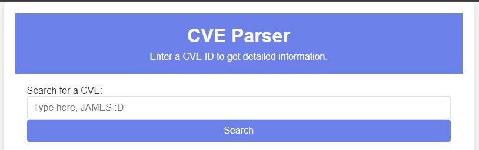
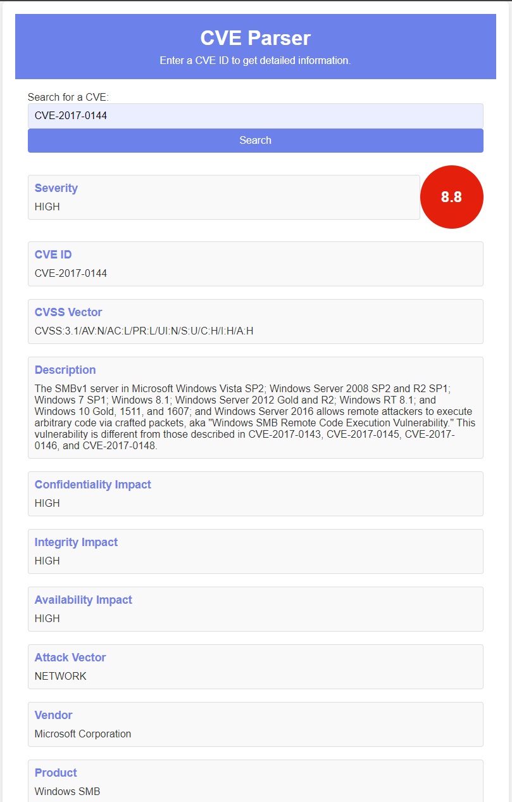
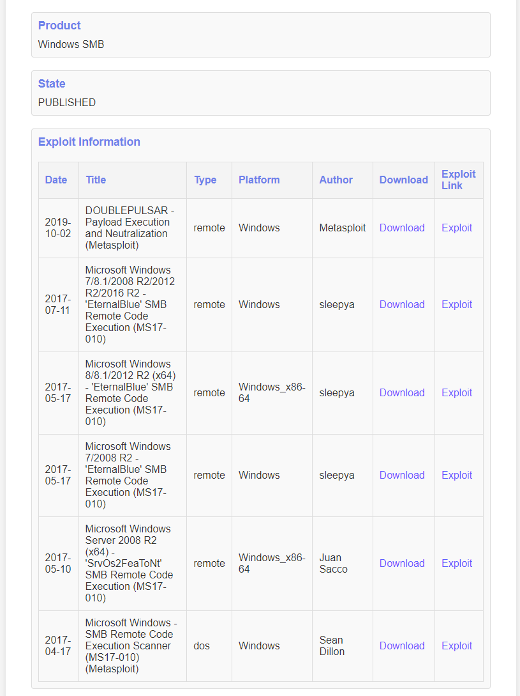
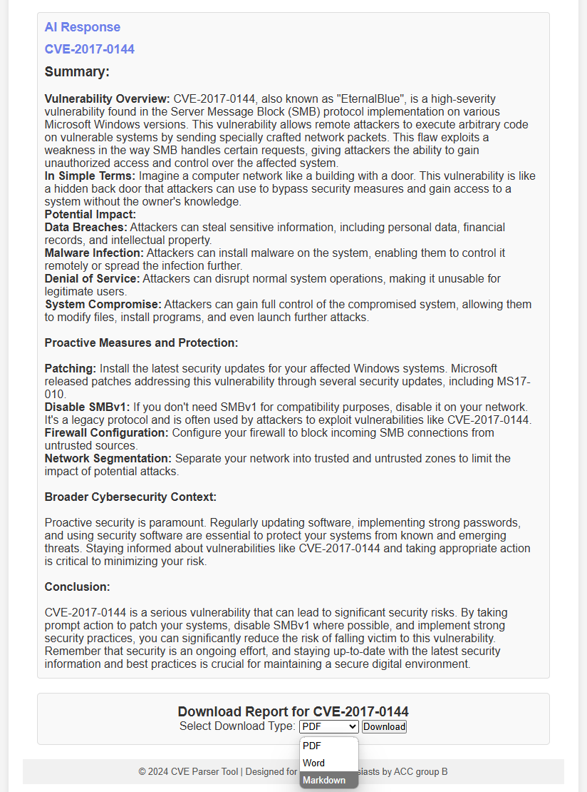
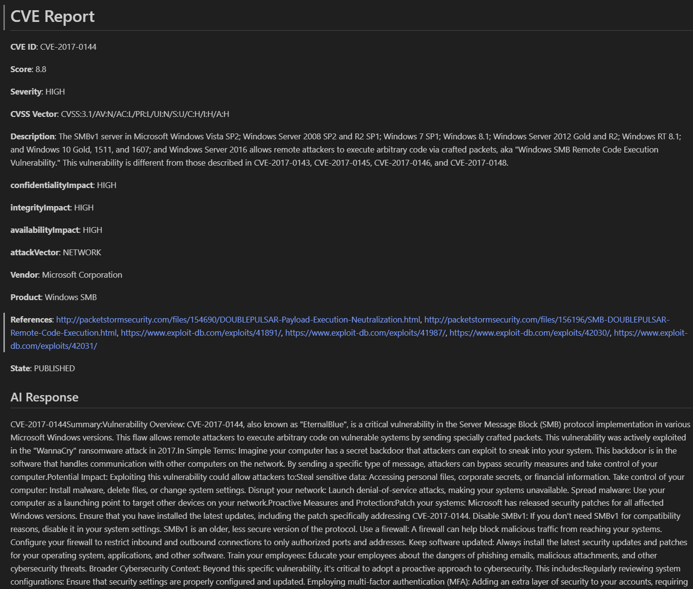

# **CVE REPORTER**

Final project of GROUP B from Azerbaijan Cyber Security Center.

This Python-based tool automates the process of gathering and analyzing information about a given CVE ID, aiding cybersecurity teams in quickly assessing vulnerabilities.


## **Features**

- Web based user-friendly interface
- Live source gathering
- Data scraping from NVD, MITRE, Exploit DB
- CVSS analysis
- Report generation in multiple file formats
- AI integration


## **Run Locally**

Clone the project

```bash
  git clone https://github.com/A1irzayevv/akm-python_final_project
```

Go to the project directory

```bash
  cd akm-python_final_project
```

Install dependencies

```bash
  pip install -r requirements.txt
```

Start the server

```bash
  python3 app.py
```


## **Screenshots**
Home page of our web app



Example output of app to CVE-2017-0144






Example of generated report as md file

## **Project Structure**

This project is organized into several Python modules, each responsible for different parts of the CVE data collection and report generation process. Below is a breakdown of the key files and their roles:

- **`app.py`**: This is the main Flask application that handles the routing, user input, and communication with other modules like `scraper.py`, `ai.py`, and `exploit.py`.

- **`scraper.py`**: This module handles the scraping of CVE data from various online resources like NVD and MITRE API. It processes the data and returns structured information about CVE vulnerabilities.

- **`exploit.py`**: This module uses Selenium to scrape data from Exploit DB, collecting available exploits related to the specified CVE ID.

- **`ai.py`**: This script interacts with the Google Gemini AI service to generate additional context and information about CVE IDs based on user queries. It leverages AI to provide deeper insights into vulnerabilities.

- **`report.py`**: This module is responsible for generating reports based on the scraped data. It includes functions to generate reports in PDF, DOCX, and Markdown formats.

- **`templates/`**: This directory contains the HTML files (using Jinja2 templates) for the front-end, including `index.html` for the input form and for displaying the scraped CVE data.

- **`static/`**: This directory holds static files like CSS and JavaScript, used for styling the front-end and adding interactivity.


## API Reference

#### Get NVD data

```https
  GET https://services.nvd.nist.gov/rest/json/cves/2.0?cveId={cveId}
```

| Parameter | Type     | Description                |
| :-------- | :------- | :------------------------- |
| `apiKey` | `string` | **Optional**. Your API key |

#### Get Mitre data

```http
  GET https://cveawg.mitre.org/api/cve/{cveId}
```

### Get AI response
```http
  VISIT https://ai.google.dev/
```

| Parameter | Type     | Description                       |
| :-------- | :------- | :-------------------------------- |
| `prompt`      | `string` | **Required**. AI api key |


## Authors

- [@A1irzayevv](https://www.github.com/A1irzayevv)
- [@Rana0000](https://www.github.com/Rana0000)
- [@srehim](https://www.github.com/srehim)
- [@Elmar404](https://www.github.com/Elmar404)

